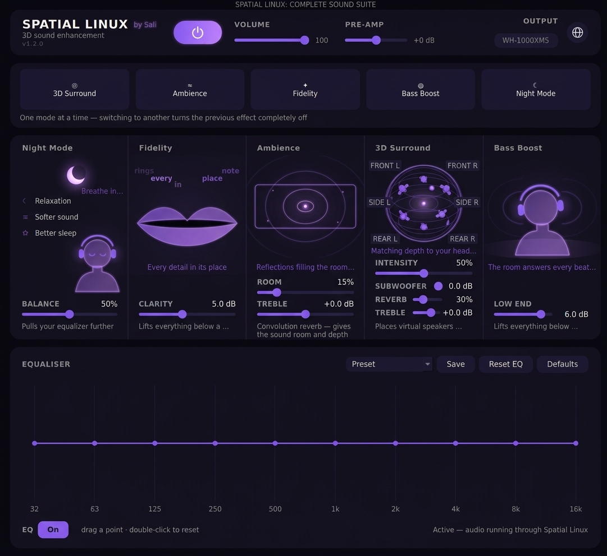

# Spatial Linux — a Boom 3D alternative for Linux



**3D sound for every app on your Linux desktop.** Looking for Boom 3D on
Linux? Spatial Linux is a free, open-source alternative. It adds a virtual
output device to PipeWire and processes everything you play through it:
3D surround for headphones, a room around the music, clarity, bass and a
night mode, plus a 10-band equaliser. It runs entirely on PipeWire's
built-in filters, so no extra audio plugins are needed.

Free and open source · made by Sali · interface in English and Turkish

<sub>Spatial Linux is an independent project and is not affiliated with or
endorsed by Boom 3D or its makers. Boom 3D is mentioned only to describe
what kind of app this is.</sub>

> [!IMPORTANT]
> **Spatial Linux does not touch your sound drivers.** It does not install,
> replace or modify any driver, kernel module, system file or PipeWire
> setting, and it never asks for root. It only adds one virtual output
> device of its own while it is switched on. Switch it off or close it and
> that device disappears and your sound goes back to your original device,
> exactly as it was. Uninstalling is just deleting its folder.

## Features

| | What it does |
|---|---|
| **3D Surround** | Moves the sound out of your headphones and into the room: virtual front and rear speakers rendered with a head model measured on a real head (MIT KEMAR). Sliders for intensity, **Subwoofer**, **Reverb** (how much room and rear speakers) and **Treble**. |
| **Ambience** | Convolution reverb that builds a room around the music, with its own **Treble** control. |
| **Fidelity** | Lifts the deepest lows and the finest highs, the ranges the ear hears least. |
| **Bass Boost** | A clean low shelf below 110 Hz. |
| **Night Mode** | Softer, even sound for late hours: pulls the equaliser down and gently compresses, so quiet details rise and loud peaks come down. |
| **Equaliser** | 10 bands from 32 Hz to 16 kHz. Drag a point, double-click to reset, switch it **On / Off** without losing the curve. |
| **Presets** | Flat, Music, Movie, Gaming, Night, Bass, and your own. Picking one applies it instantly. The built-in names follow the interface language. |
| **Pre-Amp and volume** | ±12 dB input gain, and the volume of the Spatial Linux device. |

- **One mode at a time.** Picking a mode switches the previous one off
  completely. Every mode remembers its last setting.
- **Remembers everything.** Every setting, the power state and the volume
  come back on the next launch. They are saved while you use the app, not
  only when you close it, so a crash or logout does not lose them.
- **Leaves no trace.** Switching off or closing returns the audio to the
  device it was on before. If the app is ever killed, the next launch
  cleans up after it.
- **English and Turkish.** The whole interface, including the animations
  and the introduction, is available in both. The globe button switches the
  language, and the choice is remembered.
- **Built-in guide.** A short animated introduction plays on first launch.
  The **ⓘ** button plays it again at any time.

## Which Linux?

Spatial Linux works on any distribution whose sound runs on **PipeWire 1.0
or newer**, with any desktop (KDE, GNOME, Cinnamon, XFCE, …) on Wayland or
X11. Older PipeWire versions lack some of the built-in filters it uses, and
systems that still run PulseAudio alone are not supported.

| Distribution | Works? |
|---|---|
| **Bazzite** (developed and used on it), Fedora Silverblue / Kinoite, other immutable systems | ✅ inside a distrobox container |
| **Fedora** 40 and newer, Nobara | ✅ |
| **Ubuntu** 24.04 and newer, and its flavours (Kubuntu, Xubuntu, …) | ✅ |
| **Linux Mint** 22 and newer, **Pop!_OS** 24.04, **Zorin OS** 18 | ✅ |
| **Debian** 13 (trixie) and newer | ✅ |
| **Arch**, **Manjaro**, **EndeavourOS**, **CachyOS** | ✅ with `pipewire`, `pipewire-pulse` and `wireplumber` installed |
| **openSUSE Tumbleweed** | ✅ |
| Ubuntu 22.04, Linux Mint 21, Debian 12 and older | ❌ PipeWire too old, or not used by default |

Bazzite is where it was built and tested; the other systems meet the same
requirements but have not been tried one by one. To check yours:

```bash
pactl info | grep "Server Name"    # should mention PipeWire
pipewire --version                 # should be 1.0 or newer
```

## Requirements

- Linux with **PipeWire** and **WirePlumber** (the default on current Fedora,
  Ubuntu, Bazzite, and others). The command-line tools `pw-cli`, `pw-dump`,
  `pw-metadata` and `wpctl` must be available.
- **Python 3.10+** and **PyQt6**. That's all: the measured head model used
  by 3D Surround ships with the app, so nothing else needs installing.

## Install

Download the latest `spatiallinux-<version>.tar.gz` from
[Releases](https://github.com/Nothingman333/Spatial-Linux/releases), then:

```bash
# Debian / Ubuntu (also inside a distrobox container)
sudo apt-get install -y python3-pyqt6

# Fedora
sudo dnf install -y python3-pyqt6

# Arch / Manjaro
sudo pacman -S --needed python-pyqt6

tar xf spatiallinux-*.tar.gz
cd spatiallinux-*/
./install.sh          # adds Spatial Linux to your application menu
```

To try it without installing, run `./spatiallinux.sh` from the folder.

## Updating

1. Download the latest release as a **`.zip`** (or `.tar.gz`) from
   [Releases](https://github.com/Nothingman333/Spatial-Linux/releases).
2. Extract it and **copy its files over your existing Spatial Linux folder**,
   replacing the old ones.
3. Start the app. That's all.

Your settings and your own presets are not in that folder (they live in
`~/.local/share/spatiallinux`), so updating never loses them, and you do not
need to run `install.sh` again. Only if you put the new version in a
**different** folder, run `./install.sh` from there once so the menu entry
points to it. The version you are running is shown under the app's name.

Releases marked **Pre-release** (for example `1.6.0-beta.1`) are test
versions with the newest changes. The one marked **Latest** is the stable
version; if you just want things to work, use that one.

## Uninstalling

Close the app, delete its folder, and remove the menu entry:
`~/.local/share/applications/spatiallinux.desktop` (or the exported entry,
if you used distrobox). To also forget your settings, delete
`~/.local/share/spatiallinux`.

**Bazzite and other immutable systems:** install it inside a distrobox
container. The container shares PipeWire with the host, so the audio works,
and `install.sh` puts the launcher in the host's menu.

## Usage

1. Press the **power button**. All your audio now runs through Spatial Linux.
2. Pick a **mode** on the top row and adjust it with the sliders in its panel.
3. Shape the sound on the **equaliser**, or pick a **preset**. Save your own
   with **Save**.
4. **Defaults** returns everything to the factory settings.

## How it works

Spatial Linux starts its own small PipeWire process running a
`filter-chain`. That process creates the **Spatial Linux** output device,
makes it the default, processes the sound and passes it on to your real
device. Every slider maps to a live control in the chain, so changes and
preset switches never interrupt the audio. When the process stops, PipeWire
removes everything it created, and the app restores the previous default
device.

Technical notes, including how the 3D stage is built and why
some features work the way they do: [docs/TECHNICAL.md](docs/TECHNICAL.md).
Version history: [CHANGELOG.md](CHANGELOG.md).

## Support

Spatial Linux is free and always will be. If you enjoy it and want to say
thanks, you can buy me a coffee:

[](https://ko-fi.com/W7W2DP17Q)

## Credits

3D Surround uses the **MIT KEMAR** head-related transfer function
measurements by **Bill Gardner and Keith Martin**, MIT Media Lab, 1994
([source](https://sound.media.mit.edu/resources/KEMAR.html)). The data is
provided free of restrictions on use, provided the authors are credited.
The file built from it, `spatiallinux/data/binaural_ir.wav`, is made with
[`tools/build_ir.py`](tools/build_ir.py).
